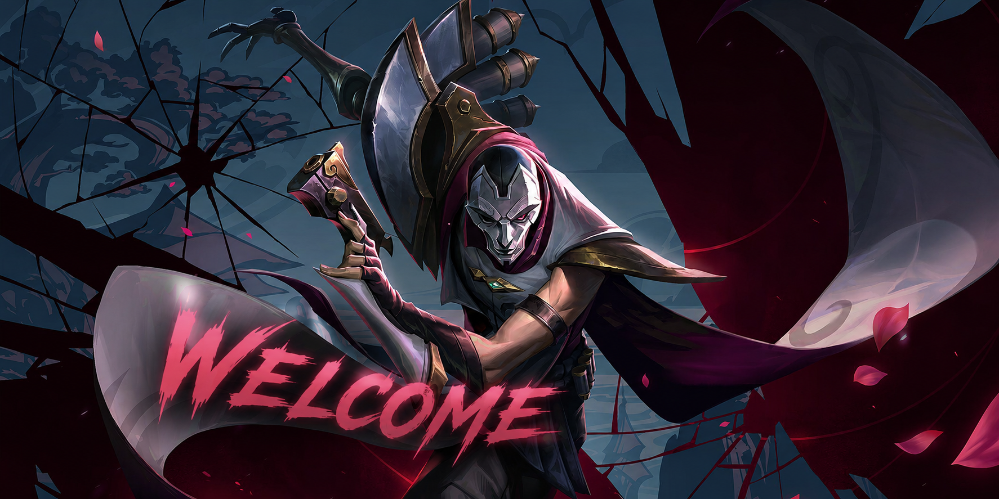

  

<h1 align="center">Olá, eu sou o Danilo Cesar! 👋</h1>

  Apenas um jovem estudante de Ciência da Computação! ☕

  
  

## 🧑‍💻 Sobre Mim
Sou estudante de **Ciência da Computação** na **CESAR School**, gosto por tecnologia, desenvolvimento web e games. Busco constantemente evoluir minhas habilidades técnicas, criar soluções criativas e transformar linhas de código em projetos reais.

- 🎓 Cursando Bacharelado em Ciência da Computação na CESAR School.
- 📜 Certificado em **JavaScript Essentials 1** pela Cisco Networking Academy.
- 💡 Focado em aprender arquitetura de software, desenvolvimento web e design voltado para tecnologia (TechDesign).

## 🛠️ Tecnologias e Ferramentas
Aqui estão algumas das tecnologias e ferramentas com as quais tenho contato e venho desenvolvendo meus projetos: Python, C++, JavaScript, CSS e HTML

  
  
  
  
  
  

## 📁 Projetos em Destaque
*Abaixo estará os principais artefatos e projetos que desenvolvi durante a graduação:*

* **SMART GLOVE** - Uma luva-controle, que tem o intuito de ser mais acessivel para pessoas com deficiencia física, as permitindo voltarem ou começarem a jogar video games.Temos um foco também na gameterapia com o projeto.

---

  <i>"Code is like humor. When you have to explain it, it’s bad."</i> 💻

